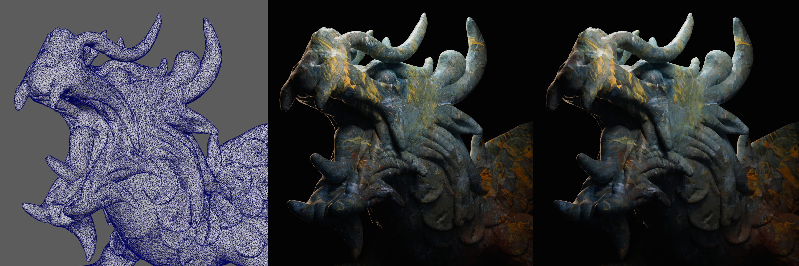
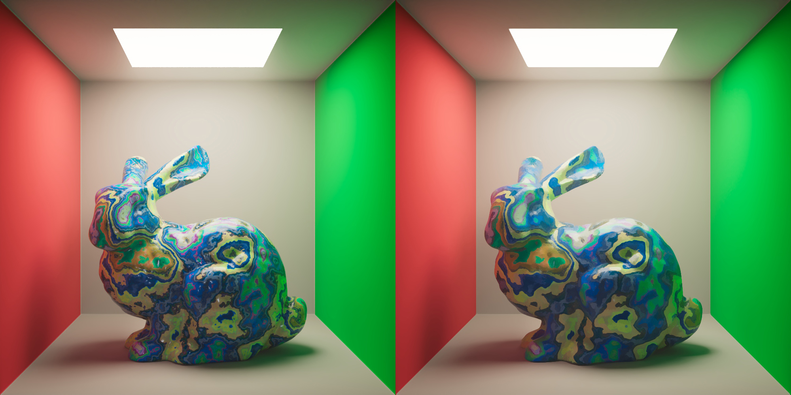
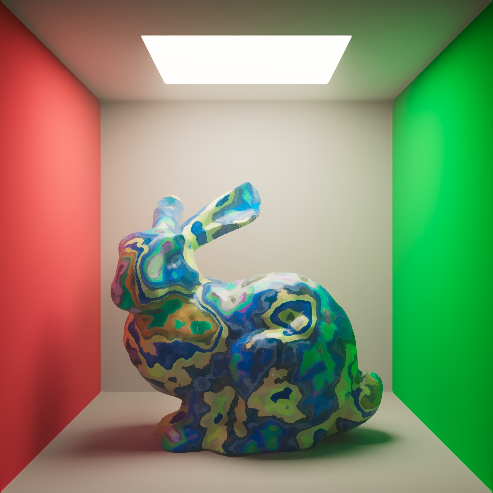

# kuwahara-arnold-imager

Set of two Arnold Imager plugins that use the [Kuwahara Filter](https://en.wikipedia.org/wiki/Kuwahara_filter) to achieve a stylized [NPR](https://en.wikipedia.org/wiki/Non-photorealistic_rendering) look.

## Feature

- **Kuwahara Filter Imager (classic Kuwahara)**  
Implements the classic Kuwahara Filter for a smooth, stylized effect.

- **Polynomial Anisotropic Kuwahara Filter Imager**  
Uses a polynomial anisotropic variation to provide greater artistic control. This imager is based on the research presented in the paper: [Anisotropic Kuwahara Filtering with Polynomial Weighting Functions](./docs/Anisotropic_Kuwahara_Filtering_Paper.pdf).

## Requirements

- C++ 17
- CMake 3.21+
- Arnold 7.3.5|7.4.0
- OpenCV
- OpenMP

*Only tested on Windows, compiled with MSVC.*

## Examples

  
*Maya Imager Demo, from a simple texture*

  
*Lion Photography*

*Higher radius example (R=15)*

*Lion Photography*

## License

This project is licensed under the [MIT License](LICENSE).

## Acknowledgements

Research paper: [Anisotropic Kuwahara Filtering with Polynomial Weighting Functions](./docs/Anisotropic_Kuwahara_Filtering_Paper.pdf).
